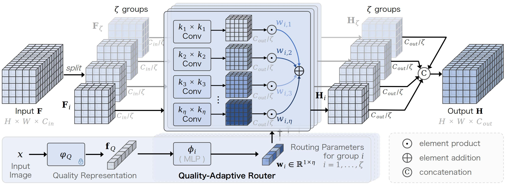
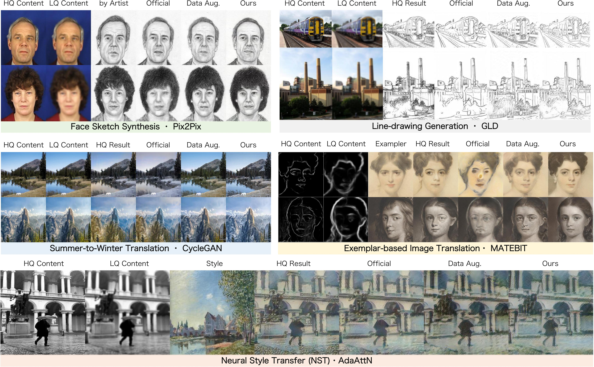

# QuARF

[AAAI-25] 
Fei Gao\*, Ying Zhou\*, Ziyun Li, Wenwang Han, Jiaqi Shi, Maoying Qiao, Jinlan Xu, Nannan Wang, QUARF: Quality-Adaptive Receptive Fields for Degraded Image Perception, The 39th Annual AAAI Conference on Artificial Intelligence (AAAI), 39(16), 16708-16716, Philadelphia, Pennsylvania, USA, Feb. 25 – Mar. 4, 2025. 


[](https://github.com/AiArt-Gao/QuARF/) [](https://ojs.aaai.org/index.php/AAAI/article/view/33836) 

## Abstract
<p align="justify">
  Advanced Deep Neural Networks (DNNs) perform well for high-quality images, but their performance dramatically decreases for degraded images. Data augmentation is commonly used to alleviate this problem, while using too many perturbed data might seriously decrease the performance for pristine images. To tackle this challenge, we take our cue from the spatial coincidence assumptionabout human visual perception, i.e. multiscale and varying receptive fields are required for understanding pristine and degraded images.Correspondingly, we propose a novel plug-and-play network architecture, dubbed Quality-Adaptive Receptive Fields (QuARF), to automatically select the optimal receptive fields based on the quality of the input image. 
To this end, we first design a multi-kernel convolutional block, which comprises multiscale continuous receptive fields.Afterward, we design a quality-adaptive routing network to predict the significance of each kernel, based on the quality features extracted from the input image. In this way, QuARF automatically selects the optimal inference route for each image. To further boost the efficiency and effectiveness, the input feature map is split into multiple groups, with each group independently learning its quality-adaptive routing parameters.We apply QuARF to a variety of DNNs, and conduct experiments in both discriminative and generation tasks, including semantic segmentation, image translation and restoration. 
Thorough experimental results show that QuARF significantly and robustly improves the performance for degraded images, and outperforms data augmentation in most cases.
</p>

## Pipeline

<p align="center"></p>


## Sample Results

<p align="center"></p>

<p align="center"></p>


## Getting Started
### 1) Get image quality feature
- Refer to the official documentation of CONTRIQUE [here](https://github.com/pavancm/CONTRIQUE) and download the weights 
  
  You can also use other quality representations by other advanced BIQA models, but you need to modify the feature dimensions to make them match.

  ```
  from CONTRIQUE_model import CONTRIQUE_model
  import numpy as np
  
  quality_model = CONTRIQUE_model(torchvision.models.resnet50(pretrained=False),2048)
  quality_model.load_state_dict(torch.load(args.model_path, map_location=args.device.type))
  quality_model.to(args.device)
  quality_model.eval()

   with torch.no_grad():
        _,_, _, _, model_feat, model_feat_2, _, _ = quality_model(image, image_2)
    quality_feat = np.hstack((model_feat.detach().cpu().numpy(),\
                                model_feat_2.detach().cpu().numpy()))
  ```
### 2) Integrate it into the model

```
from quarf import QuARF
## we prefer to insert it at the front end of the encoder.
qconv = QuARF(in_channels = 64)
```


